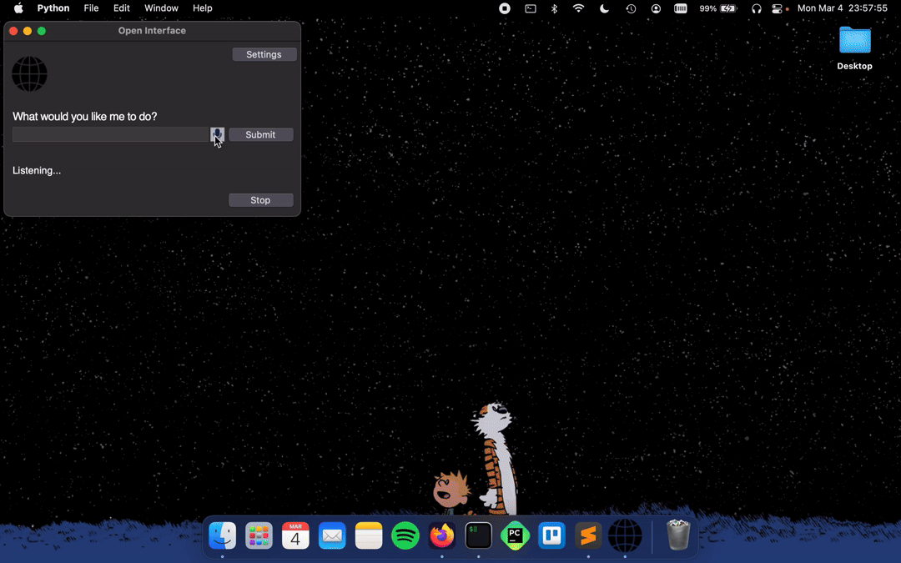

# Jarjit

<picture>
	
</picture>

### Full Autopilot for All Computers Using LLMs

Jarjit
- Self-drives computers by sending user requests to an LLM backend (GPT-4o, etc) to figure out the required steps.
- Automatically executes the steps by simulating keyboard and mouse input.
- Course-corrects by sending the LLMs a current screenshot of the computer as needed. 

<h4>Self-Driving Software for All Your Computers</h4>

  
  
  
   
  )
  
  
   
  

### <ins>Demo</ins> 💻
["Make me a meal plan in Google Docs"] 
 
[More Demos](https://github.com/zaikaman/Jarjit/blob/main/MEDIA.md#demos)

### <ins>Install</ins> 💽

    
 <b>Windows</b>

    <ul>
        <li><b>Step 1:</b> Download and Install Python
            <ul>
                <li>Download <a href="https://www.python.org/downloads/">Python 3.10 or higher</a></li>
                <li>During installation, make sure to check "Add Python to PATH"</li>
            </ul>
        </li>
        <li><b>Step 2:</b> Download Jarjit
            <ul>
                <li>Clone this repository: <code>git clone https://github.com/zaikaman/Jarjit.git</code></li>
                <li>Or <a href="https://github.com/zaikaman/Jarjit/archive/refs/heads/main.zip">download the ZIP file</a> and extract it</li>
            </ul>
        </li>
        <li><b>Step 3:</b> Install Dependencies
            <ul>
                <li>Open Command Prompt in the Jarjit folder</li>
                <li>Run: <code>pip install -r requirements.txt</code></li>
            </ul>
        </li>
        <li><b>Step 4:</b> Run Jarjit
            <ul>
                <li>In the same Command Prompt, run: <code>python app/app.py</code></li>
            </ul>
        </li>
    </ul>

    
 <b>MacOS</b>

    <ul>
        <li><b>Step 1:</b> Install Prerequisites
            <ul>
                <li>Install <a href="https://brew.sh/">Homebrew</a> if you haven't already:
                     <code>/bin/bash -c "$(curl -fsSL https://raw.githubusercontent.com/Homebrew/install/HEAD/install.sh)"</code></li>
                <li>Install Python: <code>brew install python@3.10</code></li>
            </ul>
        </li>
        <li><b>Step 2:</b> Download Jarjit
            <ul>
                <li>Clone repository: <code>git clone https://github.com/zaikaman/Jarjit.git</code></li>
                <li>Or download and extract the <a href="https://github.com/zaikaman/Jarjit/archive/refs/heads/main.zip">ZIP file</a></li>
            </ul>
        </li>
        <li><b>Step 3:</b> Install Dependencies
            <ul>
                <li>Open Terminal in the Jarjit folder</li>
                <li>Run: <code>pip3 install -r requirements.txt</code></li>
            </ul>
        </li>
        <li><b>Step 4:</b> Run Jarjit
            <ul>
                <li>In Terminal: <code>python3 app/app.py</code></li>
            </ul>
        </li>
        <li><b>Step 5:</b> Grant Permissions
            <ul>
                <li>When prompted, grant Accessibility and Screen Recording permissions in System Settings → Privacy & Security</li>
            </ul>
        </li>
    </ul>

    
 <b>Linux</b>

    <ul>
        <li><b>Step 1:</b> Install Prerequisites
            <ul>
                <li>Ubuntu/Debian: <code>sudo apt-get update && sudo apt-get install python3 python3-pip git</code></li>
                <li>Fedora: <code>sudo dnf install python3 python3-pip git</code></li>
            </ul>
        </li>
        <li><b>Step 2:</b> Download Jarjit
            <ul>
                <li>Clone repository: <code>git clone https://github.com/zaikaman/Jarjit.git</code></li>
                <li>Or download and extract: <code>wget https://github.com/zaikaman/Jarjit/archive/refs/heads/main.zip && unzip main.zip</code></li>
            </ul>
        </li>
        <li><b>Step 3:</b> Install Dependencies
            <ul>
                <li><code>cd Jarjit</code></li>
                <li><code>pip3 install -r requirements.txt</code></li>
            </ul>
        </li>
        <li><b>Step 4:</b> Run Jarjit
            <ul>
                <li><code>python3 app/app.py</code></li>
            </ul>
        </li>
    </ul>

### <ins>Setup</ins> 🛠️
After installation, you'll need to set up your GitHub API key:

1. Generate a GitHub Personal Access Token:
   - Go to [GitHub Settings → Developer Settings → Personal Access Tokens](https://github.com/settings/tokens)
   - Click "Generate new token (classic)"
   - Name it "Jarjit Access Token"
   - Select scopes: `read:user` and `user:email`
   - Copy the generated token

2. Configure Jarjit:
   - Launch Jarjit
   - Click Settings in the top right
   - Paste your GitHub token
   - Click Save and restart Jarjit

Optional: To handle rate limits, you can add multiple tokens in `app/resources/api_keys.json`:

### <ins>Stuff It's Bad At (For Now)</ins> 😬

- Accurate spatial-reasoning and hence clicking buttons.
- Keeping track of itself in tabular contexts, like Excel and Google Sheets, for similar reasons as stated above.
- Navigating complex GUI-rich applications like Counter-Strike, Spotify, Garage Band, etc due to heavy reliance on cursor actions.

### <ins>Future</ins> 🔮
(*with better models trained on video walkthroughs like Youtube tutorials*)
- "Create a couple of bass samples for me in Garage Band for my latest project."
- "Read this design document for a new feature, edit the code on Github, and submit it for review."
- "Find my friends' music taste from Spotify and create a party playlist for tonight's event."
- "Take the pictures from my Tahoe trip and make a White Lotus type montage in iMovie."

### <ins>Notes</ins> 📝
- Cost: Free! Uses GitHub's API with generous rate limits
- You can interrupt the app anytime by pressing the Stop button, or by dragging your cursor to any of the screen corners.
- Jarjit can only see your primary display when using multiple monitors. Therefore, if the cursor/focus is on a secondary screen, it might keep retrying the same actions as it is unable to see its progress (especially in MacOS with launching Spotlight).

### <ins>System Diagram</ins> 🖼️